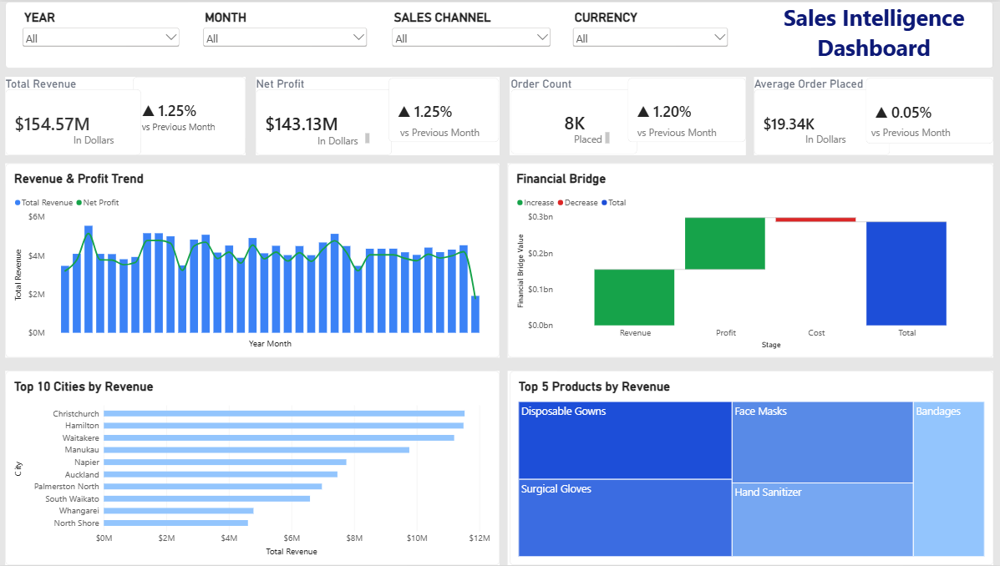

# Sales Data ETL, Data Warehouse & Power BI Dashboard

An end-to-end sales data analytics project built using **MySQL and Power BI**.

This project demonstrates the complete process of taking raw sales data through an ETL pipeline, performing data validation and error handling, loading the cleaned data into a dimensional data warehouse, implementing incremental loading and ETL logging, and finally connecting the processed data to Power BI for interactive business analysis.

---

## 📊 Dashboard Preview



The Power BI dashboard provides an interactive view of sales performance, revenue, profit, orders, cities, products, and trends.

---

# 📌 Project Overview

The objective of this project is to build a structured and reusable sales data pipeline that can transform raw source data into analysis-ready data for business intelligence reporting.

The project covers:

- Data ingestion
- Landing layer
- Data validation
- Data quality checks
- Error handling
- Staging layer
- Dimension tables
- Fact table
- Data warehouse modeling
- Stored procedures
- Incremental loading
- ETL metadata
- ETL execution logging
- Event-based ETL execution
- Power BI dashboard development

---

# 🏗️ Project Architecture

```text
   RAW SALES CSVs
                                 │
                                 ▼ (LOAD DATA INFILE)
                         ┌───────────────┐
                         │ Landing Layer │
                         │   (l_*)       │
                         └───────┬───────┘
                                 │
                 [ Incremental ETL Watermark Check ]
                   (load_time > v_last_load_time)
                                 │
                    Data Quality & Validation
                                 │
             ┌───────────────────┴───────────────────┐
             │                                       │
      (Valid Records)                        (Invalid Records)
             │                                       │
             ▼                                       ▼
      ┌─────────────┐                         ┌─────────────┐
      │   Staging   │                         │    Error    │
      │    (s_*)    │                         │    (e_*)    │
      └──────┬──────┘                         └─────────────┘
             │                                (Nulls, Duplicates,
             │ Transformations                 Range & Regex Errors)
             ▼
      ┌──────────────────────────────────────────────┐
      │             MySQL Data Warehouse             │
      │                 (Star Schema)                │
      │                                              │
      │   ┌───────────────┐      ┌───────────────┐   │
      │   │  dim_customer │      │  dim_product  │   │
      │   └───────┬───────┘      └───────┬───────┘   │
      │           │                      │           │
      │           └────────► ┌───────────┴───────┐   │
      │                      │    fact_sales     │   │
      │           ┌────────► └───────────┬───────┘   │
      │           │                      │           │
      │   ┌───────┴───────┐              │           │
      │   │   dim_region  │              │           │
      │   └───────────────┘              │           │
      └──────────────────────────────────┼───────────┘
               │                         │
      Audited  │                         │ Direct / Import
      During   ▼                         ▼ Connection
         ┌──────────────┐        ┌──────────────────────────────┐
         │ ETL Metadata │        │     Power BI Desktop         │
         │   & Logs     │        │  (Semantic Model & DAX)      │
         └──────────────┘        └──────────────┬───────────────┘
                                                │
                                                ▼
                                 ┌──────────────────────────────┐
                                 │ Sales Intelligence Dashboard │
                                 └──────────────────────────────┘
